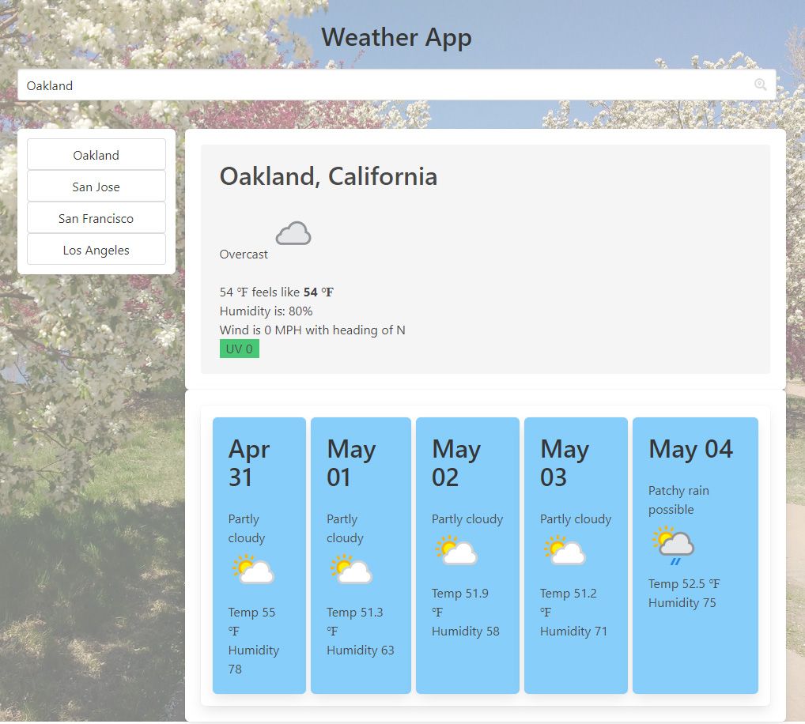

# Weather
The Weather App is a weather dashboard with clean, polished, responsive, friendly and pleasing weather dashboard that utilizes weatherapi.com as the 3rd party API providing access to all the cities around the world.

The site utilizes a search bar where the user can type in their city search and click on the search icon, hit enter or tab to pull the data for a city filtered in the United States.  Searching for cities by country, region and zip code will be added at a later date.

Your weather dashboard also provides a list of your 10 most recently visited cities so the user can easily click on a past visited city to pull up the data.

When the user visits the site again.  The current weather of the last city they searched will be displayed on the screen by default.  Nobody likes to see empty displays.

Along with the searched cities current condition, they are provided with and icon that represents the weather, the current temperature, what it feels like outside, the humidity, wind, wind direction and UV.  The UV includes a background that changes color at recommended UV warning levels by the EPA and World Health Organization.

The user is presented with a 5 day forecast which includes, the forecasted weather condition, a representative icon, temperature and humidity.

## Site Picture



## Technology Used
- weatherapi.com   
3rd Party API providing access to the current weather conditions and forecasted weather around the world.
- HTML and CSS   
HTML provides the user interaction with the use of CSS to provide a clean, responsive, user-friendly app for the user.
- JavaScript and jQuery
Powers the application as explained below.
- Bulma.io   
Provides the CSS Framework and responsiveness.
- Photoshop
Making the public domain background images semi-transparent and creating a snapshot of the screen.


## Code Snippet
The site initializes from calling the updateCities function.  This gets the cities from localStorage and renders it to the cache.  It also sees if it is the first visit where the parameter init will be equal to init and 
JavaScript
```
function updateCities(init) {
    // get cities from localStorage and write it into the cities Array
    cityArr = [];
    cityArr = JSON.parse(localStorage.getItem('cities'));
    // if init is equal str init, set City to cityArr[0]
    if(init === "init") {
        city = cityArr[0];
        // get the weather for the last city visited and render it.
        getWeatherApi();
    }
    // Display on the screen in the button area
    renderCache();
}
``` 

Function formatDate renders the date for the forecast tiles to a pleasing readable date formate.
JavaScript
'''
formatedDate = function(strDate) {
    var monthArr = ["Jan", "Feb", "Mar", "Apr", "May", "Jun", "Jul", "Aug", "Sep", "Aug", "Nov", "Dec"];
    var date = strDate.slice(5).split('-');
    console.log(date);
    var i = parseInt(date[0]);
    var month = monthArr[i];
    console.log(month);
    console.log(date[1]);
    var strDate = month + " " + date[1];
    return strDate;

}
'''

Function renderForecast renders the forecast tiles.  It receives a parameter object containing the 5 days forecast.  It parses the information and displays it in each tile.
Note the date does a callback to the formatDate function to get a more readable date.  Each tile and paragraph tag uses the index of the array in each of the tags ID attribute.
JavaScript
```
function renderForecast(obj) {
    $('#forecast-div').empty();
    var forecast = obj.forecastday;
    
    console.log(forecast);
    // iterate through each object in the forecast array
    for (var i = 0; i < forecast.length; i++) {
        var date = formatedDate(forecast[i].date);
        console.log('Forecast Date is a ' + typeof(date) + ' === ' + date);
        // Create the tile (card) for each of the forecast days
        $('#forecast-div').append('<article id="forecast-'+i+'" class="box">');

        // Add the Date to each tile
        $('#forecast-'+i).append('<p id="fcDate-'+i+'" class="title">');
        $('#fcDate-'+i).text(date);

        // Add the forecasted condition
        var fcIcon = forecast[i].day.condition.icon;
        if(fcIcon.indexOf(":") === -1) {
            fcIcon = "https:" + fcIcon;
        }
        $('#forecast-'+i).append('<p id="fcCond-'+i+'" class="">');
        $('#fcCond-'+i).html(forecast[i].day.condition.text);
        $('#forecast-'+i).append('');

        $('#forecast-'+i).append('<p id="fcTemp-'+i+'">');
        $('#fcTemp-'+i).html("Temp " + forecast[i].day.avgtemp_f + " <span>&#8457</span>");

        $('#forecast-'+i).append('<p id="fcHumidity-'+i+'">');
        $('#fcHumidity-'+i).html("Humidity " + forecast[i].day.avghumidity);

    }
}
```

## Author Links
### Michael Downs
[LinkedIn](http://www.linkedin.com/in/michaeldownssj)  
[GitHub](https://chindowns.github.io/) 

### Sources
public-domain-photos.com provideds the background image
weatherapi.com provides the current and forecasted weather and weather icons